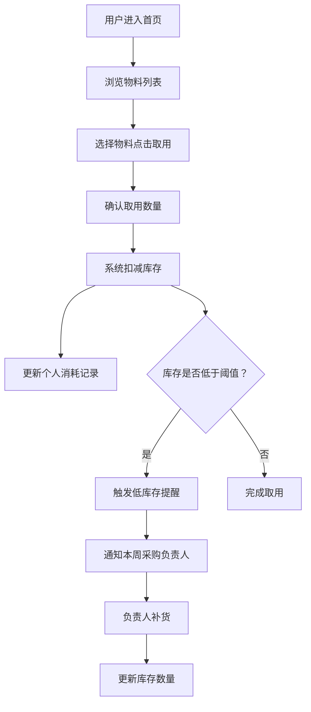

## 1. 产品概述

办公室共享咖啡/茶水角物料消耗追踪工具，帮助团队管理咖啡豆、茶包、牛奶等物料的库存与消耗。通过扫码取用、自动扣减库存、低库存提醒、投票补货、消耗统计等功能，实现咖啡角的透明化、自动化管理。

- 解决问题：物料库存混乱、采购不及时、费用分摊不透明
- 目标用户：办公室全体同事、轮值采购负责人
- 核心价值：提升咖啡角运营效率，实现消耗透明化，增强团队参与感

## 2. 核心功能

### 2.1 用户角色

| 角色 | 注册方式 | 核心权限 |
|------|----------|----------|
| 普通同事 | 扫码/昵称登录 | 取用物料、参与投票、查看统计 |
| 采购负责人 | 轮值轮换 | 管理库存、查看低库存提醒、处理补货 |

### 2.2 功能模块

1. **首页/物料取用**：物料列表、扫码/点击取用、快速扣减、取用确认
2. **库存管理**：物料库存展示、低库存预警、补货记录、阈值设置
3. **投票模块**："我想喝什么"投票、候选列表、投票统计、结果展示
4. **消耗统计**：个人月度消耗、全员排行、品类统计、费用分摊计算
5. **采购轮值**：本周负责人展示、轮值日历、提醒通知
6. **个人中心**：我的取用记录、我的投票、月度账单

### 2.3 页面详情

| 页面名称 | 模块名称 | 功能描述 |
|---------|----------|----------|
| 首页 | 物料卡片列表 | 展示所有物料及当前库存，点击取用按钮扣减库存 |
| 首页 | 快速取用面板 | 选择物料+数量，确认后扣减，显示成功动画 |
| 首页 | 低库存提醒横幅 | 库存低于阈值时醒目提示，显示本周采购负责人 |
| 库存管理页 | 库存列表 | 按品类展示物料、库存数量、阈值状态、补货按钮 |
| 库存管理页 | 补货操作 | 输入补货数量、记录补货人、更新库存 |
| 投票页 | 投票列表 | 展示本轮投票候选，支持多选投票 |
| 投票页 | 投票结果 | 实时显示各选项得票数和百分比，柱状图展示 |
| 统计页 | 个人消耗统计 | 本月取用记录、消耗总杯数、费用估算 |
| 统计页 | 全员排行榜 | 按消耗数量排序，显示头像、姓名、杯数 |
| 统计页 | 品类分析 | 各物料消耗占比、趋势图表 |
| 统计页 | 费用分摊 | 月度总费用、人均分摊、个人应付金额 |
| 采购轮值页 | 本周负责人 | 展示本周采购负责人姓名、联系方式 |
| 采购轮值页 | 轮值日历 | 月度轮值表，可查看历史和未来轮值安排 |

## 3. 核心流程

### 3.1 物料取用流程
用户进入首页 → 选择想要取用的物料 → 点击取用按钮 → 确认取用数量 → 系统扣减库存 → 显示取用成功 → 更新个人消耗记录

### 3.2 低库存提醒流程
库存扣减后检查数量 → 低于阈值触发提醒 → 首页显示预警横幅 → 推送通知给本周采购负责人 → 负责人进行补货

### 3.3 投票流程
进入投票页 → 查看本轮候选饮品 → 选择喜欢的选项（可多选）→ 提交投票 → 实时更新投票结果 → 投票截止后生成补货参考

### 3.4 费用分摊流程
月度结算 → 统计总消耗物料及费用 → 按人数计算人均分摊 → 生成个人账单 → 公开展示排行榜（匿名化可选）

## 4. 用户界面设计

### 4.1 设计风格

- **整体风格**：温暖舒适的咖啡色调 + 现代简约风，营造轻松的办公室氛围
- **主色调**：深咖啡色 (#6F4E37) 作为主色，奶油白 (#FFF8E7) 作为背景色
- **辅助色**：抹茶绿 (#88B04B) 表示充足库存，暖橙色 (#E67E22) 表示低库存警告，深红色 (#C0392B) 表示严重不足
- **按钮风格**：圆角胶囊形按钮，带有微妙阴影，悬停有轻微上浮效果
- **字体**：展示字体使用具有设计感的圆润字体，正文使用清晰易读的无衬线字体
- **布局风格**：卡片式布局，柔和阴影，圆角设计，大量留白
- **图标风格**：线性图标搭配咖啡、杯子、茶叶等相关emoji，增强视觉趣味性

### 4.2 页面设计概览

| 页面名称 | 模块名称 | UI 元素 |
|---------|----------|---------|
| 首页 | 顶部导航 | Logo、页面标题、个人头像入口 |
| 首页 | 低库存提醒条 | 橙红色背景、警告图标、负责人信息 |
| 首页 | 物料卡片网格 | 2-3列布局、物料图标、库存进度条、取用按钮 |
| 首页 | 快速统计 | 今日取用、本月消耗、节省金额 |
| 库存管理页 | 分类标签 | 咖啡豆、茶包、奶制品、其他 |
| 库存管理页 | 库存列表项 | 物料名称、当前数量、阈值标记、补货按钮 |
| 投票页 | 投票标题区 | 本轮主题、截止时间、投票进度 |
| 投票页 | 选项卡片 | 饮品图片/图标、名称、得票进度条、投票按钮 |
| 统计页 | 数据概览卡片 | 总杯数、总费用、参与人数 |
| 统计页 | 排行榜列表 | 排名、头像、姓名、杯数、费用 |
| 统计页 | 饼图/柱状图 | 品类占比、月度趋势 |
| 采购轮值页 | 本周负责人卡片 | 大头像、姓名、联系方式、交接提示 |
| 采购轮值页 | 轮值日历 | 月视图、高亮当前周、可点击查看详情 |

### 4.3 响应式

- 桌面端优先设计，兼顾平板和手机端
- 桌面端：3列物料卡片网格，侧边导航
- 平板端：2列网格，顶部导航
- 手机端：单列布局，底部导航栏
- 触控优化：按钮最小44px，触摸区域充足

### 4.4 动效设计

- 页面加载：元素淡入+上移，错落有致
- 取用成功：弹出成功提示，数字滚动动画
- 库存变化：进度条平滑过渡，颜色渐变
- 投票提交：按钮缩放反馈，进度条增长动画
- 悬停效果：卡片轻微上浮，阴影加深
