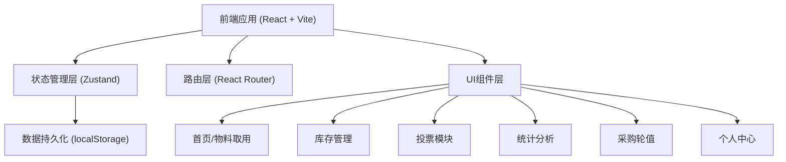
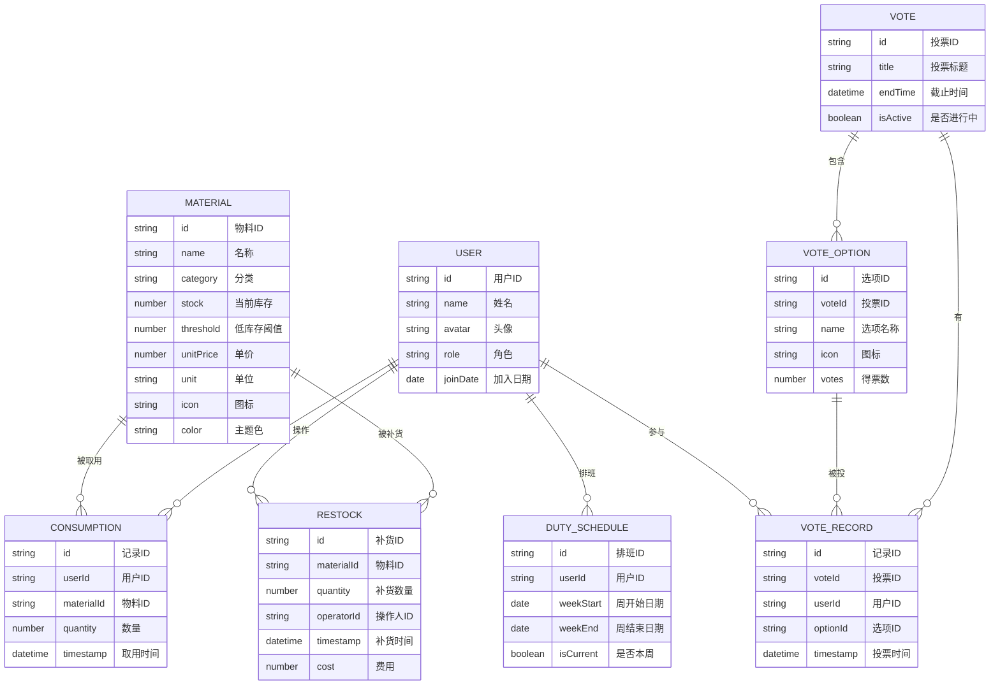

## 1. 架构设计



## 2. 技术描述

- **前端框架**：React@18 + TypeScript
- **构建工具**：Vite@5
- **样式方案**：TailwindCSS@3 + CSS 变量
- **状态管理**：Zustand（轻量级，适合中小规模应用）
- **路由管理**：React Router v6
- **图标库**：Lucide React（现代化线性图标）
- **图表库**：Recharts（React图表组件库）
- **数据存储**：localStorage（前端持久化，无需后端）
- **动画**：Framer Motion（流畅的交互动画）

## 3. 路由定义

| 路由路径 | 页面名称 | 功能说明 |
|---------|----------|----------|
| / | 首页 | 物料列表、快速取用、低库存提醒 |
| /inventory | 库存管理 | 库存列表、补货操作、阈值设置 |
| /vote | 投票页面 | "我想喝什么"投票、结果展示 |
| /stats | 统计分析 | 个人消耗、全员排行、品类分析、费用分摊 |
| /duty | 采购轮值 | 本周负责人、轮值日历 |
| /profile | 个人中心 | 我的记录、我的投票、月度账单 |

## 4. 数据模型

### 4.1 数据模型定义



### 4.2 初始数据 (Mock Data)

#### 用户数据
- 预设 8-10 位同事，包含姓名、头像、角色
- 1 位当前周采购负责人

#### 物料数据
- 咖啡豆：3-4 种（意式拼配、单品豆、低因咖啡等）
- 茶包：3-4 种（绿茶、红茶、乌龙茶、花草茶等）
- 奶制品：2-3 种（牛奶、燕麦奶、椰奶等）
- 其他：糖、饼干等小食

#### 消耗记录
- 最近 30 天的模拟取用数据
- 每人每天 1-3 次取用

#### 投票数据
- 一轮进行中的投票
- 5-7 个候选选项
- 部分已投票记录

#### 轮值数据
- 最近 4 周和未来 4 周的排班表

## 5. 核心功能模块

### 5.1 物料取用模块
- 物料列表展示（卡片式布局）
- 点击取用 → 选择数量 → 确认扣减
- 库存实时更新，进度条动画
- 取用成功反馈动画
- 自动记录到个人消耗

### 5.2 库存管理模块
- 分类标签切换
- 库存列表展示（名称、数量、阈值状态）
- 低库存高亮标记
- 补货操作弹窗
- 补货历史记录

### 5.3 投票模块
- 投票主题展示
- 候选选项卡片（图标、名称、得票进度）
- 多选投票
- 实时结果更新
- 投票截止倒计时

### 5.4 统计分析模块
- 数据概览卡片（总杯数、总费用、参与人数）
- 个人月度统计
- 全员消耗排行榜
- 品类占比饼图
- 月度趋势柱状图
- 费用分摊计算

### 5.5 采购轮值模块
- 本周负责人大卡片展示
- 轮值日历月视图
- 周次高亮
- 负责人联系方式

## 6. 目录结构

```
src/
├── assets/           # 静态资源（图片、图标等）
├── components/       # 公共组件
│   ├── Layout/       # 布局组件
│   ├── MaterialCard/ # 物料卡片
│   ├── StatsCard/    # 统计卡片
│   └── Modal/        # 弹窗组件
├── pages/            # 页面组件
│   ├── Home/         # 首页
│   ├── Inventory/    # 库存管理
│   ├── Vote/         # 投票
│   ├── Stats/        # 统计
│   ├── Duty/         # 轮值
│   └── Profile/      # 个人中心
├── store/            # 状态管理
│   ├── useUserStore.ts
│   ├── useMaterialStore.ts
│   ├── useConsumptionStore.ts
│   └── useVoteStore.ts
├── types/            # TypeScript 类型定义
├── utils/            # 工具函数
│   ├── date.ts       # 日期处理
│   ├── storage.ts    # 本地存储
│   └── calculation.ts # 计算工具
├── data/             # Mock 数据
├── App.tsx           # 应用入口
├── main.tsx          # 渲染入口
└── index.css         # 全局样式
```
